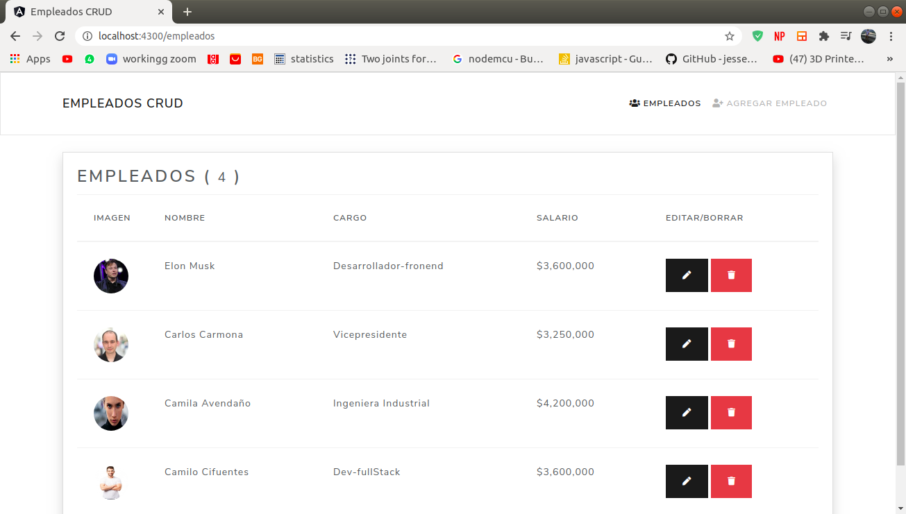
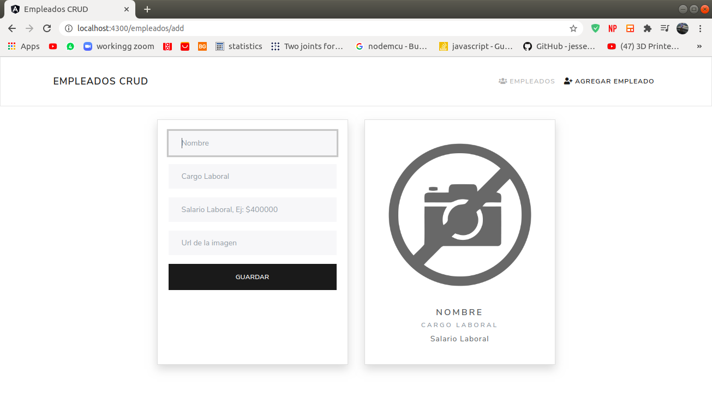
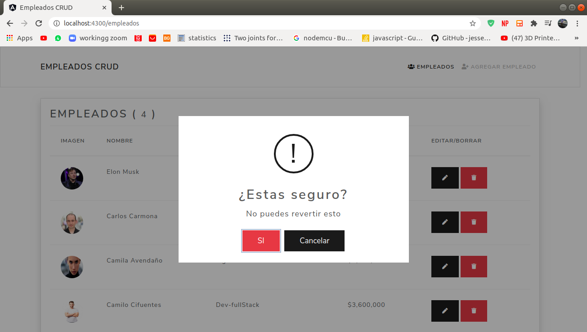
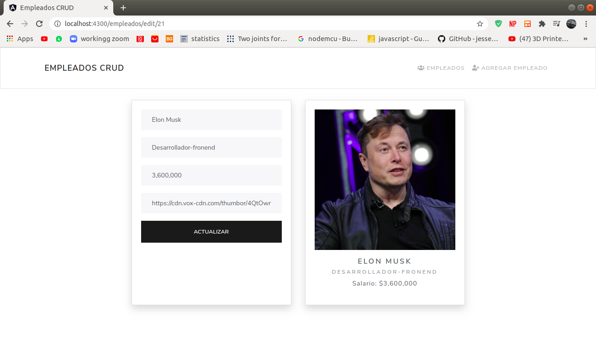

# EmpleadosFrontend

Proyecto CRUD con [Angular CLI](https://github.com/angular/angular-cli) version 10.0.2.

## Vista principal GET


## Dependencias Usadas
1. @sweetalert2, version: 10.3.5
2. Bootstrap, (CDN), version: 4.5.2
3. fontawesome, (CDN), version: 5.13

## Para iniciar
1. Recuerda ejecutar
    ```
    npm install
    ```
2. Ejecuta y monitorea los cambios en el servidor de desarollo
    ```
    ng serve
    ```
3. Navega a `http://localhost:4200/`.


4. Para correr las pruebas de desarrollo vía [Karma](https://karma-runner.github.io).
    ```
    ng test
    ```
5. Para correr pruebas end-to-end vía [Protractor](http://www.protractortest.org/).
    ```
    ng e2e
    ```
### POST

### POST

### POST

